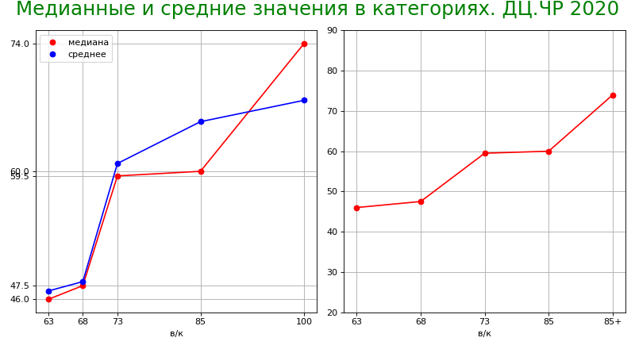
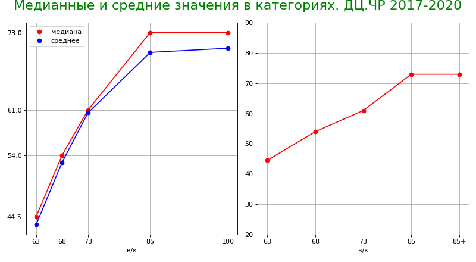
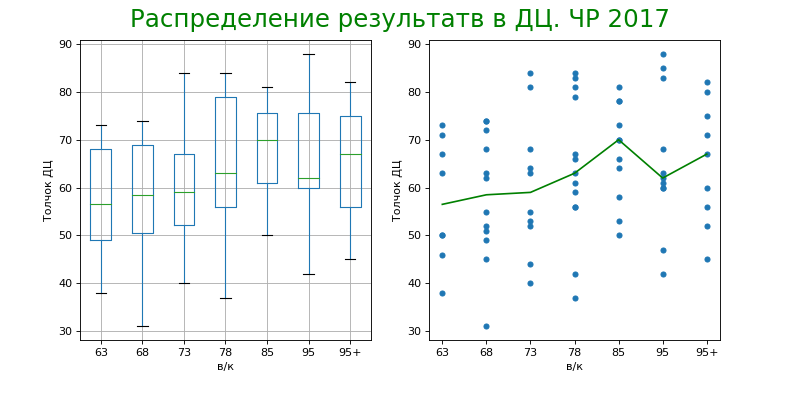
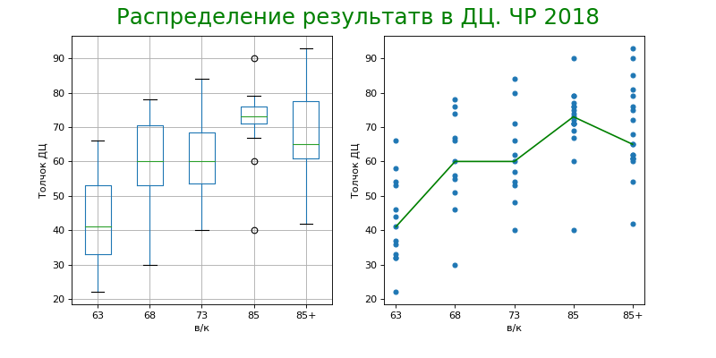
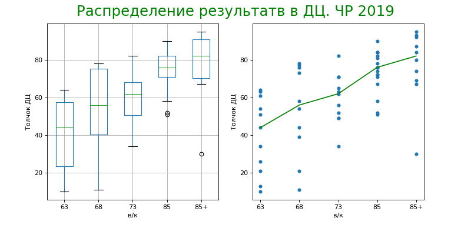
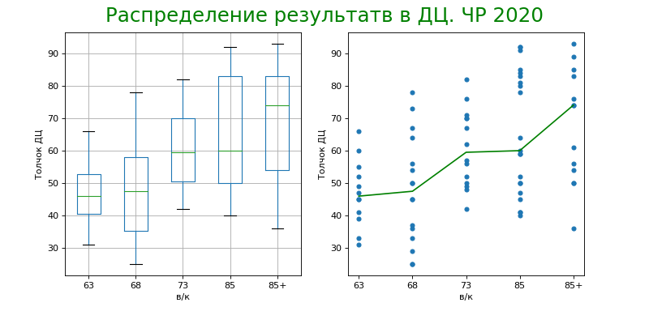
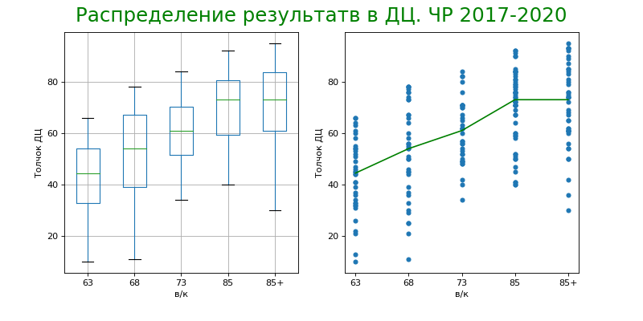

[вернуться на главную](https://alekseidudchenko.github.io/giristat/)
# Тяжелые спортсмены поднимают больше? 
### Анализ ДЦ и весовых категорий на Чемпионатах России 2017-2020 

Привет! Много дискуссий вокруг весовых категорий в гиревом спорте. 

Давайте попробуем посмотреть на это с разных углов, но в первую очередь - с точки зрения данных.

## Поехали
На момент написания доступы протоколы 2017, 2018, 2019, 2020 годов.

Возьмём для анализа Чемпионаты России как самые главные старты года. 

## Вес vs Результат
Посмотрим, есть ли зависимость между собственным весом спортсмена на момент взвешивания и его результатом. Будем рассматривать Длинный цикл и Двоеборье отдельно.

*Здесь я привожу диаграмму для двоеборья, чтобы показать что картина очень прхожа. Но в дальнейшем в этой статье будет рассматриваться только ДЦ.*

Первое, что мы видим это сгустки точек вдоль линий, которые соответствуют весовым категориям. В особенности категориям 63, 68 и 73. Причем точки выстраиваются не просто вдоль линий, а именно слева от них. Это еще лучше видно на рисунке снизу. Действительно, мы с вами знаем как часто спортсмены тренируются в весе больше соревновательного и часто перед самым взвешиванием  интенсивно сбрасывают его, чтобы войти в категорию. 

Посмотрите на рисунок снизу. Мы никогда не встретим спортсмена с весом 63,100 или даже 64. То есть спортсмены своим поведением демонстрируют сильную веру в два убеждения. 
- Первое: Больший вес дает преимущество (в разумных пределах конечно) 
- Второе: в категории "ниже" больше шансов (опять же с кучей оговорок и ограничений). 
То есть если у тебя вес 64 нужно срочно или его увеличить до 68 и поднимать больше, или сбросить до 63 и тоже поднимать больше. Естественно поднимать больше - это всегда главное.

  *да, в протоколах есть запись, где спортсмен выступал в категории 85+, при собственном весе 74.55. Скорее всего это банальная очепятка.* 

Описанная выше закономерность расположения точек слева от линий не работает в категориях 78 и 85 (два верхних рисунка). Это объясняется очень просто. Данные диаграмм - это Чемпионаты России с 2017 по 2020. 2017 - это последний год, где категория 78 была представлена. Так же как и категория 95. 

В категории свыше 85 совсем ничего не понятно. В этом отношении интересно было бы посмотреть данные до 2017 года, особенно за те года когда еще была категория 105. Напишите мне, если у вас есть эти данные.

## Средние и медианные значения

Допустим, первые два графика совсем не убедительны в ответе на вопрос есть ли корреляция между весом и результатом. Другими словами пока не ясно, оправданно ли наличие 5 весовых категорий и нужно ли сокращать их еще.
Тогда обратимся к средним и медианным значениям. 

Думаю, все помнят про среднюю температуру по больнице или среднюю зарплату в России, поэтому предлагаю ориентироваться на медианы (ниже обозначены красным). Однако найдем для каждой категории и то и другое.  

Поскольку, как я уже упомянул, после 2017 действует новый ЕСВК и другое количество категорий, будем стоить графики отдельно по каждому году.

### 2017

*Здесь и далее на графиках слева категории 95+(2017) и 85+ обозначены как 100.*

По оси Х отложены весовые категории в масштабе. Это тоже несет в себе информацию, потому что между 63 и 68 "расстояние" меньше чем между 85 и 95. Это важно, но графики воспринимать проще, если мы пренебрежем этим масштабом (см. графики справа).
График справа фактически это то же самое что нарисовано красной линией слева. Можете проверить значения. Разница лишь в том, 
1. что "расстояние" между категориями теперь одинаковое; 
2. график сильно уменьшен, как будто колёсико мышки покрутили назад и мы теперь смотрим на него издалека (обратите внимание на отметки по оси Y) но при этом в ширину график остался такой же.  

### 2018

### 2019

### 2020 

### 2018-2020
Ну и давайте построим такую же диаграмму для последних трех лет вместе.

Мне кажется, последний график выглядит почти идеально.

## Усложним 
Если здесь все верно, то вопрос можно закрывать. Корреляция между категориями на лицо. В каждой следующей категории медиана результатов в ДЦ выше чем в предыдущей. Идеально. Ну кроме категории 85+.

Однако, если позанудствовать, то можно вспомнить про выбросы - значения которые сильно выбиваются из распределения. Ну например, кто-то поставил гири через 2 минуты - передумал. Допустим, у него результат 5 подъемов, а остальные в его категории подняли от 34 до 60. Нужно ли этот результат в 5 подъемов учитывать?

По секрету, медиана робастна к выбросам. Поэтому она и имеет преимущество перед средними значениями. Но статика существует не первый год и там есть инструменты поинтереснее чем просто медиана и среднее. Давайте разберем один из них. 

[Диаграмма размаха](https://ru.wikipedia.org/wiki/%D0%AF%D1%89%D0%B8%D0%BA_%D1%81_%D1%83%D1%81%D0%B0%D0%BC%D0%B8 "wiki") показывает сразу медиану, нижний и верхний квартили, минимальное и максимальное значение выборки и выбросы если они есть. 

### 2017

Здесь слева - та самая диаграмма размаха. А справа - результаты, сгруппированные по категориям и их медианы. Этот график отличается от самого первого на странице тем, что здесь мы отбрасываем информацию о весе и вместо этого используем только информацию о весовых категориях.

На левом рисунке результаты так же сгруппированы по весовым категориям и медианы тоже показаны. Здесь медианы - это зелёные полоски в середине прямоугольников. Значения у них естественно те же, что и справа. Фактически эти два графика показывают одни и те же данные, просто в разной форме.

Риски на диаграмме размаха (слева) это максимальный и минимальный результат в категории. Эти риски ещё называют усами, а диаграмму - ящик с усами. Легко запомнить. От нижней риски до начала прямоугольника - "нижние" 25% всех результатов. От верхнего края прямоугольника до верхней риски - "верхние" 25%. Эти отрезки по 25% результатов называт квартилями. Если ваш результат выше прямоугольника и иниже верней риски - вы в первой четверти лучших спортсменов этой категории. Внутри прямоугольника - "средние" 50% результатов, два "средних" квартиля. Медиана отделяет один от другого.

Посмотрим для остальных годов.

### 2018

Здесь мы видим выбросы в категории 85. Что интересно, как вверх, так и вниз. Довольно интересная аномалия, особенно учитывая, что ни в других категориях, ни в другое годы выбросов сверху нет. Возможно это как-то связано с тем фактом, что 2018 - это первый год, когда убрали категории 78 и 95. Можно посмотреть на это подробнее, но как-нибудь в другой раз. 

### 2019

Здесь тоже есть выбросы снизу в категориях 85 и 85+, но дальше мы увидим, что это выбросы только в масштабе одного года. В масштабе нескольких лет они вполне вписываются в распределение.

### 2020 

Здесть все чисто. И красиво.

### 2018-2020
Ни и давайте построим такую же диаграмму для последних трех лет вместе.

Тут, кстати, хорошо видно преимущество ящиков с усами пред простым отображением точек. Когда точек становится слишком много, сложно что-то разглядеть.

На мой взгляд, у нас идеальная картина. При переходе в следующую категорию увеличивается всё, и максимальный результат (конец верхнего уса), и начало прямоугольника (граница квартиля), и медиана и даже вторая граница прямоугольника. Исключение только с нижним результатом в категории 85+. Но я не считаю это значительным.

## Заключение
Однозначно мы увидели, что текущие категории в ДЦ имеют смысл. Нет категорий которые "проседают".

В другой статье я подобным образом рассмотрю двоеборье. 

Не переключайтесь.

[вернуться на главную](https://alekseidudchenko.github.io/giristat/)